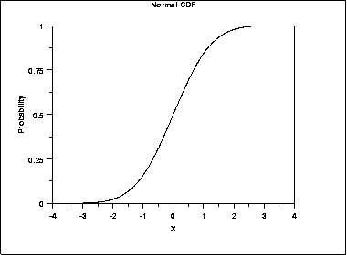
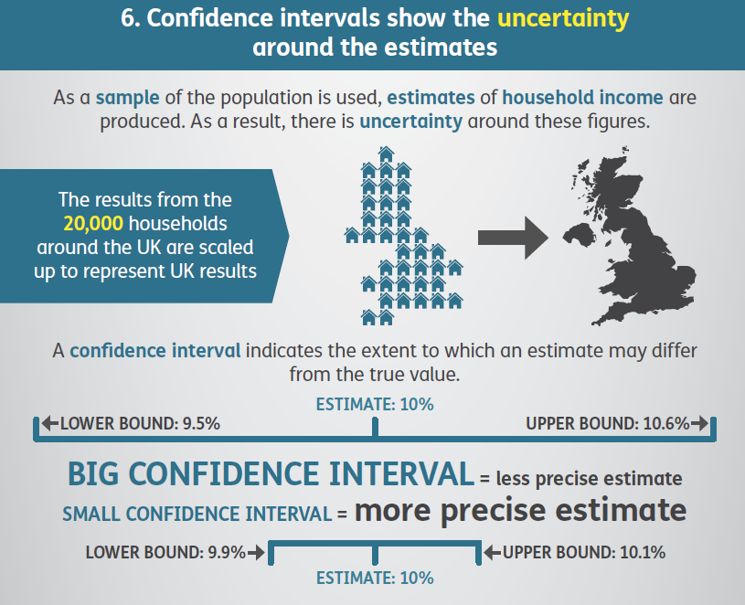

# Presenting and Communicating uncertainty
<h5right> This chapter looks at how to choose <i>which</i> messages we should communicate to decision makers about uncertainty, and gives advice on <i>how</i> to communicate those messages effectively.</h5right>

<h4> Choosing what to communicate</h4>

<h5right> The analysis of uncertainty is often complex, and presenting this in its entirety may be overwhelming to the recipient. Therefore we need to choose which messages about uncertainty to communicate to decision makers – ensuring they receive enough information to understand the key points, without receiving so much that it clouds the central issue. <br><br> The overall uncertainty is what we need to communicate, but often we don’t have a clearly quantified measure of this. </h5right>

## Framing the different uncertainties

<h5left><br> If most uncertainty is quantified then present this prominently </h5left>

### If most of the overall uncertainty has been quantified (aleatory or epistemic), then this should be the most prominent message. Discussion of the unquantified uncertainties and risks can be included, but should be positioned so that they don’t reduce confidence in the main results unnecessarily.

### If there are significant unquantified uncertainties (epistemic or ontological), then presenting the uncertainty that has been quantified may give a misleading impression of precision and thereby underestimate the uncertainty (i.e. don’t present a range if you know that there are substantial uncertainties that are not accounted for in that range).

<h5left><br> However, if little is quantified, then it may be better to present no quantification  at all </h5left>

### If the greatest source of uncertainty is the potential for a risk outside of the analysis to be realised, then this should be the most prominently displayed message.  

<h5left><br> If there is a major risk that has not been included in the analysis, then this may be greatest uncertainty </h5left>

### If quality assurance has been very limited then presenting any measure of uncertainty may be misleading. In such circumstances where the greatest source of uncertainty is the potential for error, then this should be the most prominent message that is conveyed to the decision maker. This may be in the form of an analytical assurance statement that highlights areas of concern.

<h5left><br> If quality assurance has been very limited, it may be best to lead with this </h5left>

### Think about how caveats are presented – a long list is unhelpful, but two or three upfront that have the most impact on the results are likely to be more helpful and easily understood.

<h5left><br> Front load the important caveats and explain why they matter </h5left>

<h4> Deciding how to communicate it </h4>

<h5right> Now you have determined what the message is you need to consider how to communicate with your decision makers. What kind of situation are you in – written report, presentation, or an oral briefing with or without visuals? Any constraints on format may steer you to an approach. <br><br> Regardless of the situation, we recommend putting the uncertainty first when communicating – e.g “These results are interim. This policy showed a saving &#163;xm in 2017 and therefore…”. The rationale is that we read top to bottom, so put the key caveat first. <br><br> This section considers a range of approaches based on your understanding of the audience and the type of message you need to deliver <br><br> You should also consider the onward communication of your message to ensure that when your work is passed on its core message and integrity are maintained.  </h5right>

## Understanding the audience

<h5left><br> Consider the audience when choosing appropriate communication methods </h5left>

### People respond differently to different communication methods. We need to assess the intended audience to understand appropriate communication methods. The audience might be: 
<ul><li> Analytical </li>
<li> Non-analytical </li>
<li> Mixed </li>
<li> Someone you have worked with before - in which case tailor it to what has worked well in the past (or ask them, or see how they respond to different formats). </li> </ul>

### In presentations we often use advice from Aristotle to repeat our main message:
<h5left><br> A combined approach will repeat your message and appeal to a wider audience </h5left>
<ul><li> Say what you are going to say </li>
<li> Say it </li>
<li> Say what you just said. </li> </ul>
### This is a powerful way of communicating your message in all situations. When communicating uncertainty your repetition can be achieved using different approaches to reach a wider audience. {-}

### If there are multiple audiences , then consider whether different communications should be created for each group.

<h5left> <br> Consider whether more than one approach might be beneficial </h5left>

### A good relationship with your decision maker will help you to understand their needs and choose the right approach for them reducing risks.

<h5left> Build relationships with decision makers to understand their needs and reduce wider risks </h5left>

### Think about what motivates the decision maker. For example, if the analysis is ultimately for the Chancellor of the Exchequer, you may get their interest more quickly by communicating early on that a policy would break one of the fiscal rules, rather than a policy change costing an extra &#163;2bn (although that should still be communicated).

### No matter how carefully you communicate the uncertainty to your immediate client, there is a risk that only the central numbers will persist and the uncertainty is overlooked. A good relationship with colleagues will minimise this risk and ensure that you have sight of such messaging before it goes out.

### There are also risks around writing part of a larger document – you need to ensure that what you have said fits into the bigger document. A close relationship throughout can help with this.

## Language

<h5left><br> Avoid using words alone </h5left> 

### Research shows that analysis is deemed to be less reliable if the outputs are conveyed only in words (even though some people may generally prefer to receive information in words). Therefore using words alone to convey uncertainty is discouraged.

### Descriptive terms for probabilities are interpreted very differently by people, so should generally be avoided (e.g. ‘low risk’, or ‘very likely’). It is better to attach a numerical probability to the uncertainty, even if this is entirely subjective. 

<h5left><br> Avoid descriptive terms for uncertainty unless there is an established system in place </h5left>

### An exception to this is where there is an established system within the sector for attaching terminology to probabilities, one that can be assumed to be well-understood by the intended audience. For example:
<ul><li> According to the IPCC (Intergovernmental Panel on Climate Change), “very likely” means 90-100% probability. </li>
<li> According to NICE (National Institute for Health and Care Excellence), probabilities of between 1 in 100 and 1 in 10 are referred to as “common”. </li>
<li> GAD have said it’s more effective to say this event (e.g. rivers flooding) will occur “once every 50 years” rather than “2% of the time”.  </li></ul>

### Presenting the likelihood of success may be perceived differently to presenting the corresponding likelihood of failure. Therefore presenting the information both ways can help avoid bias (e.g. “there is an 80% chance of success and a 20% chance of failure”). By adding in the chance of failure, the reader is reminded that there is a 20% chance of failure – which may otherwise be overlooked. Visual part-to-whole comparisons can help with this.

<h5left><br> Use positive and negative framing </h5left>

### We should frame our advice from an audience perspective and events that they are interested in occurring (or not occurring).  What decisions are they making based on our analysis and how can we explain the impacts of our findings in relation to those needs?  For example “If you make this decision, this is what could happen to the thing you care about”.

<h5left><br> Describe a possible outcome </h5left>

### There is no clear preference for choosing between probabilities and fractions (e.g. 10% probability, or 1 out of 10). Given this, the preferences of the audience should be considered. The ‘norm’ within the organisation may be best followed.

<h5left><br> Decide whether to present percentages or frequencies </h5left>

### If using fractions, keep the denominator constant (e.g. “1 in 100 vs. 2 in 100”, rather than “1 in 100 vs. 1 in 50”) and as small as possible while keeping to integers (e.g. “1 in 100” rather than “10 in 1,000”), rounding if appropriate.

<h5left><br> Keep denominators small and consistent when using fractions </h5left>

### Saying a ‘10% chance of rain’ is meaningless unless you also state the time period – e.g. in the next hour, or at some point tomorrow – and location.

<h5left><br> Be clear on the specifics </h5left>

### If the outputs are only intended for use within a specific frame then make sure this is clearly stated alongside the outputs. For example, they may refer to a specific area or to a particular group of the population.

<h5left><br> Be clear about the applicability of the analysis </h5left>

### Think about the word you use to describe the outputs. Are they 'estimates', ‘predictions’, ‘forecasts’, ‘projections’ or ‘scenarios’? Each of these has different connotations   . Avoid words that imply certainty, such as ‘result’, or ‘answer’.
<h5left><br> Choose an appropriate word for the outputs </h5left>
<ul><li> <b>Forecasts</b>: Analysis about the future, relatively robust, with all major sources of uncertainty quantified and included in the analysis. This is our best estimate of what we think will happen, including the full range of plausible outcomes.</li>
<li> <b>Projections</b>: Analysis concerning the future, but less robust than a forecast, perhaps including some significant assumptions where the uncertainty hasn’t been quantified. This is an estimate of what <i>might</i> happen given certain assumptions  (that may not have been thoroughly tested).</li>
<li> <b>Scenarios</b>: Analysis concerning the future, but not robust as they include some assumptions that may not be likely to occur. This is an estimate of what we think <i>would</i> happen if certain things happened.</li></ul>

## Numbers

<h5left><br> Use an appropriate level of precision </h5left>

### Consider the overall uncertainty in the numbers you have calculated, and round appropriately to avoid spurious accuracy (e.g. perhaps 40% rather than 38.7% if the overall uncertainty is greater than one percentage point).

### Presenting a single figure is best avoided as it can give a misleading impression of precision (e.g. “between 1,200 and 1,800”, rather than “1,500”).

<h5left><br> Use ranges wherever possible </h5left>

### Commissioners may request a ‘best estimate’ for ease of onward use, but you must consider the risks in providing this. Try to understand how they intend to use the analysis, so you can provide something that meets their needs while also acknowledging the uncertainty.

### Stating a range may be perceived as a uniform distribution across the range. Conversely, stating a range around a best estimate may be perceived as a triangular distribution (or Normal with analytical audiences). Consider which of these best reflects the actual uncertainty when deciding what to present.

<h5left><br> Consider whether to include a 'best estimate' within the range </h5left>

### Don’t simply use 95% confidence intervals by default. Think about what the outputs are going to be used for (see section 1), and discuss the level of risk and uncertainty that the decision maker wants to plan for – this might not be 5%.

<h5left><br> Choose appropriate condience/prediction intervals and be clear </h5left>

### Be clear what level of confidence level you are using and ensure your audience understands what this means (avoiding precise statistical definitions if it will increase comprehension).

### Presenting numbers within a sentence helps give context, making them easier to read and understand. It also makes it easier for the recipient to copy the entire sentence, reducing the risk of misunderstanding where the outputs are being used in other documents.

<h5left><br> Present key numbers in prose </h5left>

## Tables

### I've left this section blank for now as it needs a fair bit of work

## Graphs and visualisation

<h5left><br> Graphs can be an excellent way of communicating the quantified elements of uncertainty </h5left>

### Graphs and visualisations are an excellent way of communicating the outputs of analysis, and many graph types allow you to communicate uncertainty within the graphic (provided the uncertainty has been quantified).

### Unquantified uncertainties cannot generally be included in graphs, so will need to be communicated through other means.

### Some types of graph are not particularly well suited to displaying quantified uncertainty:

<h5left><br> Some graph types cannot be used to show uncertainty clearly </h5left>

<ul><li> Pie/donut charts </li>
<li> Stacked graphs </li>
<li> Choropleth maps (and most other geographical visualisations) </li>
<li> Sankey diagrams </li>
<li> Heatmaps </li>
<li> Treemaps </li>
<li> Most complex visualisations </li></ul>

### As a result, uncertainty must be communicated through other means (e.g. description). Therefore these formats may not be appropriate if the communication of quantified uncertainty is critical to the analysis. {-}

### You may have the full understanding of the underlying probability distribution, or just a range within which we expect the result to fall with a given probability. You may choose to only include the uncertainty due to a single dominant uncertainty, or the outputs from a range of scenarios.

<h5left><br> Decide what level of detail to include on uncertainty </h5left>

### The following table suggests some graph types that can be used for most situations, each of which are described in the following section.

|                                          | Single Measure                                                                    | Multiple Measure                  | Time Series           | 2-dimensional data         |
|------------------------------------------|-----------------------------------------------------------------------------------|-----------------------------------|-----------------------|----------------------------|
| None                                     | Single point graph, or describe in prose                                          | Bar graph or line graph           | Line graph            | Scatter graph              |
| A Range                                  | Single point graph with error bars                                                | Bar or line graph with error bars | Line graph with range | Scatter with 2d error bars |
| Summary Statistics                       | Single box plot                                                                   | Series of box plots               | ?                     | ?                          |
| Maximum Detail                           | Probability Distribution Function (PDF) or Cumulative Distribution Function (CDF) | Multiple PDFs or Violin Plots     | Fan chart             | ?                          |
| Uncertainty due to the methodology       | Scatter Plot                                                                      |                                   | Spaghetti Plot        | Spaghetti Plot             |
| Uncertainty due to alternative scenarios | Describe in prose                                                                 |                                   | Multiple Line Graphs  |                            |

## Errors bars

<h5left><br> Error bars are a simple way to illustrate a range around a data point </h5left>

### Error bars can be added to bar graphs, line graphs and scatter graphs to illustrate a range around a central estimate, within which we expect the value to lie with a given probability.

### As referred to previously, consider the situation and decide on an appropriate level to display.  E.g., don’t apply 95% confidence/prediction intervals by default. 

<h5left><br> Choose an appropriate probability level based on the context </h5left>

### State what probability the error bars represent, and describe in prose how the viewer should ‘read’ the error bar.

<h5left><br> Be clear about what the error bars represent </h5left>

### Error bars be added easily to a data series or time series. However, if the data are continuous (e.g. a time series) then consider whether showing multiple line graphs would be clearer than a single line graph with error bars.

<h5left><br> Error bars can be applied to series of data points </h5left>

### If the output data are 2-dimensional, then you can apply error bars in 2 dimensions. Be careful to ensure that the resulting graph does not become illegible due to clutter.

<h5left><br> 2-dimensional error bars can be used where necessary </h5left>


```{r fig.align="center"}

knitr::include_graphics("images/error_bars.png")

```

## Box plots

<h5left><br> Box plots can convey more information about possible outcomes than a range alone </h5left>

### Box plots can help the audience understand the underlying distribution of possible outcomes in more detail than just a range. Typically they show the median, interquartile range, maximum and minimum values for the range of possible outcomes. This can be particularly useful when the underlying distribution is skewed or non-normal.

### Box plots can be arranged in parallel to show the distributions for a range of measures, and can help compare the different shapes.

<h5left><br> A series of box plots can be used to compare distributions </h5left>

### Box plots may not be widely understood by non-analysts, so think carefully about whether the added information will be effective, or whether a simple range would be sufficient. A labelled example can be used to help the audience interpret the format.

<h5left><br> Think about whether the audience will be familiar with the format </h5left>

```{r fig.align="center"}

knitr::include_graphics("images/box_plots.png")

```

## Probability density functions (PDFs)

<h5left><br> PDFs show complete information on the quantified uncertainty </h5left>

### A probability density function can be used to give complete information on the range of possible outcomes, and the likelihood of each for a given estimate.

### While presenting complete information may seem ideal, it may be more information than the audience actually needs. Would a prose description of the mean and range be sufficient?

<h5left><br> Think about whether the audience needs this much information </h5left>

### If the PDF is approximately normal, then there may be little value in displaying it, as the essential features can be described in a few words.

<h5left><br> PDFs can be useful when the distribution of outcomes is multimodal, or otherwise complex </h5left>

### However, if the distribution is multimodal , then it could be misleading to present the mean, so a graphical illustration of the distribution may be more effective.

### It may aid clarity to draw the reader’s attention to important features, such as the mode.

<h5left><br> Labelling can be used to highlight the key features </h5left>

```{r fig.align="center"}

knitr::include_graphics("images/pdf.png")

```

## Multiple Probability Density Functions

<h5left><br> Small multiples can be used to show the uncertainty across a number of different measures </h5left>

### If we need to communicate a series of PDFs, then multiple functions can be shown to compare the range of possible outcomes across the series.

### If there are only 2 or 3 these can be overlaid to make it easy to compare. With more, ‘small multiples’ are likely to be clearer.

```{r fig.align="center"}

knitr::include_graphics("images/multiple_pdf.png")

```

### Violin plots are essentially mirrored PDFs which can be more aesthetic. Additional information (such as box plots) can be overlaid if required.

<h5left><br> Violin plots can be used to compare PDFs </h5left>

```{r fig.align="center"}

knitr::include_graphics("images/violin_plots.png")

```

## Cumulative density functions (CDFs)

<h5left><br> A CDF may be more helpful than a PDF if there is a specific threshold of interest to the customer </h5left>

### A cumulative density function essentially shows the same information as a probability density function. However a CDF may be more helpful when the audience is primarily concerned with how likely it is that the value will be below (or above) a particular point (rather than the range within which we expect the value to fall). For example , how likely is it that our costs exceed our budget? (rather than what are our costs going to be?)

### However, features such as the mode are less clear on a CDF (shown by the steepest part of the graph), as they are harder to read by eye.

<h5left><br> The most likely value is less clear on a CDF </h5left>

### Drawing gridlines intersecting at key points of the function can help the viewer understand how to ‘read’ the graph.

<h5left><br> Labelling can be used to highlight the key features </h5left>

```{r fig.align="center"}



```

## Fan Charts

<h5left><br> Fan charts can show how uncertainty changes over time </h5left>

### Fan charts can be used to show a series of different prediction intervals for time-series projections (e.g. 30%, 60% and 90% at the same time).

### This is essentially plotting selected points from a time-dependent PDF.

### Often a central ‘best estimate’ is not included, to avoid the viewer focussing on a single estimate and undermining the importance of the uncertainty

<h5left><br> Avoid including the mode </h5left>

```{r fig.align="center"}

knitr::include_graphics("images/fan_chart.png")

```

## Spaghetti Plots

<h5left><br> Spaghetti plots can be used to show the results from a range of different methodologies </h5left>

### If the methodology is believed to be the dominant source of uncertainty, then showing results with multiple different methodologies can be effective.

### Less importance is placed on quantified uncertainties, and more on the general consensus of results.

### Potential flaws are that all methodologies are given equal weight, which may not be appropriate.

<h5left><br> Other sources of uncertainty should be considered </h5left>

### Also, the uncertainty within each methodology is not shown.

```{r fig.align="center"}

knitr::include_graphics("images/spaghetti.png")

```

## Multiple Line Charts

<h5left><br>Multiple line charts can be clearer than a series of error bars </h5left>

### Multiple line charts with time series data to show a quantified range around a ‘most likely’ projection (essentially a series of error bars).

### With scenario analysis, a series of line charts can be used to show the projections from each scenario.

<h5left><br>Alternative scenarios can be illustrated with multiple line graphs</h5left>

### Generally with scenario analysis each scenario should be presented with equal prominence, to avoid suggesting that one is more likely than another (unless analysis has been carried out to quantify the likelihoods of each).

<h5left><br>Give equal prominence to each scenario</h5left>

### Try to include an even number of scenarios, to avoid having a middle option that may be misinterpreted as the ‘most likely’ scenario.

<h5left><br> Try to have an even number of scenarios </h5left>

```{r fig.align="center"}

knitr::include_graphics("images/multiple+line.png")

```

## Tornado Diagrams

<h5left><br>Tornado diagrams can be used to show the sources of uncertainty </h5left>

### Tornado diagrams are different to most other graphs discussed here. They are not used to show the outputs of the analysis, but to show how different sources of uncertainty contribute to the overall uncertainty.

### Tornado diagrams depict sensitivity of a result to changes in selected variables.

### They show the effect on the output of varying each variable at a time, keeping other input variables at their assumed values.

### If the level of uncertainty is unpalatable to the customers, then this format can be useful to help focus work on reducing the level of uncertainty in key parameters.

<h5left><br> Can help communicate the reasons for uncertainty, and identify further need for analysis </h5left>

### One limitation of the format is that only one parameter is changed at a time. There are some situations where the uncertainty due to one variable may appear small initially, but becomes much more prominent if a second variable takes on a slightly different value (e.g. think of a workflow model with a bottleneck. A tornado diagram might show the bottleneck parameter to be the overwhelming uncertainty. However, if this parameter is increased slightly then the bottleneck may move elsewhere, completely changing the picture)

<h5left><br> Tornado diagrams can be misleading in complex models </h5left>

```{r fig.align="center"}

knitr::include_graphics("images/tornado.png")

```

## Infographics

<h5left><br> Infographics can be useful for public facing communications </h5left>

### Infographics are graphic visual representations of information, data or knowledge intended to present information quickly and clearly. They can improve people’s understanding by using graphics to enhance peoples’ ability to see patterns and trends.

### When done well they will grab the reader’s attention from their otherwise busy day and become a very powerful way of communicating key messages.

<h5left><br> They grab attention </h5left>

### Investing in and designing a good infographic may be worthwhile if your audience is less confident with data and analysis.

<h5left><br> The additional graphics and text make your charts and messages more accessible </h5left>

### An example where uncertainty in the form of confidence intervals has been explained using an infographic is in the Households Below Average Income Report, ONS :

<h5left><br> Example – confidence intervals </h5left>

```{r fig.align="center"}



```

### A simple infographic can be used to help the reader visualise the relative magnitude of numbers.  This may be useful if we want to demonstrate either the magnitude of the uncertainty relative to the overall result.  E.g. below helps the reader to interpret four percentages10 

<h5left><br> Visualise relative magnitudes </h5left>

```{r fig.align="center"}


```

### Infographics can use a lot of space and can become overly simplistic. Consider the format being used to determine if an infographic is the right choice.

<h5left><br> Avoid common pitfalls </h5left>

### For wider principles of good infographic design and common mistakes to avoid see: https://www.nngroup.com/articles/designing-effective-infographics/ 

<h5left><br> Refer to other sources for general principles around infographic design </h5left>

## Interactive Tools

<h5left><br> Interactive tools can be used to immerse your reader on complex matters </h5left>

### An interactive tool can help to bring analysis to life and make it more accessible to non-specialists. They can create an immersive experience that is easier for them to understand and is highly memorable.

### Consider the overall message and where the uncertainties lie. Which aspects will the audience be interested in and what do they need to hear? Use this understanding to bring focus to which interactive elements to create. 

<h5left><br> Focus on specific messages </h5left>

### The interactivity will enable your users to manipulate and get a deeper understanding of the message.

### If a key source of uncertainty is a single variable, then it may be possible to construct a display that can be changed as the user adjusts the value of this variable by moving a slider.

<h5left><br> Allow reader to adjust a key variable </h5left>

### Or, if there are several key assumptions that impact the result a chart may be created that will change depending on the inputs that the user inserts.

### Being able to see what would happen if an underlying assumption was to change is a powerful way to demonstrate the level of uncertainty we may have in a given result.

### If the communication with the decision maker is limited to a printed report, then interactive tools will not be possible.

<h5left><br> Not possible on traditional printed format. Example - DECC 2050 Calculator </h5left>

### The [DECC 2050 Calculator](http://2050-calculator-tool.decc.gov.uk/#/calculator)  is an award-winning, user-friendly tool that helps users to explore the choices available to meet the 2050 carbon target. Whilst it doesn’t explicitly cover the uncertainty in the underlying data it does allow the user to create their own set of policies to try to reach the target. This engaging tool was helpful in demonstrating to users how difficult some of the options are and the relative impact of each choice. 